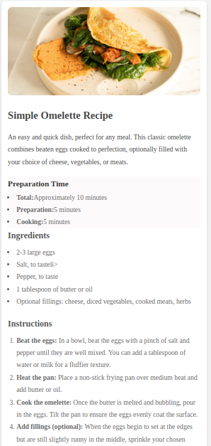

# Recipe Page README

This README file provides information about the **Recipe Page** project, detailing its structure, usage, and customization options.

# Screenshot

## Overview

The Recipe Page is a simple, responsive web page designed to showcase a recipe in a visually appealing and user-friendly format. It includes sections for preparation time, ingredients, instructions, and nutritional information.

## File Structure

- **HTML File**: Contains the content structure of the recipe page.
- **CSS (Inline)**: Provides styles to enhance the visual appeal and ensure responsiveness of the page.

## Key Features

1. **Responsive Design**: Optimized for various screen sizes using media queries.
2. **Structured Layout**: Includes sections for:
   - Recipe Title and Description
   - Preparation Time
   - Ingredients
   - Cooking Instructions
   - Nutritional Information
3. **Interactive Styles**: Ensures a clean, modern look with padding, margins, and shadow effects.

## HTML Structure

### `header`
- Displays the recipe image and title.
- Includes a brief description of the dish.

### `div.preparation-time`
- Provides details about the preparation and cooking times.
- Organized as an unordered list.

### `section.Ingredients`
- Lists the ingredients required for the recipe.
- Includes optional ingredients as suggestions.

### `section.Instructions`
- Step-by-step instructions presented as an ordered list.
- Contains clear formatting with bold labels for each step.

### `section.nutrition`
- Highlights nutritional values in a tabular format.

## CSS Styling

### Global Styles
- Applied to reset default margins and padding.
- Implements the `box-sizing: border-box` property.

### Body
- Sets the background color to `#f2f2f2` and text color to `#333`.
- Adds padding for better spacing on larger screens.

### `.container`
- Centers content with a maximum width of `800px`.
- Adds a white background, rounded corners, and shadow effects.

### Responsive Design
- Utilizes media queries for screens smaller than `600px`.
- Reduces padding and font sizes for better mobile usability.

## Customization

1. **Image**
   - Replace the `src` attribute in the `` tag inside the `header` with the path to your desired image.

2. **Recipe Content**
   - Modify the text in each section to include your own recipe details.

3. **Styling**
   - Adjust the CSS to fit your design preferences (e.g., colors, fonts, spacing).

## How to Use

1. Copy the HTML and CSS code into your project.
2. Open the `.html` file in a web browser to view the recipe page.
3. Modify the content or style to fit your specific requirements.

## Additional Notes

- Ensure the image path in the `src` attribute points to a valid image file.
- The nutrition table assumes no additional fillings are added to the recipe. Adjust values accordingly for specific variations.

## License
This project is free to use and modify for personal or commercial purposes.

