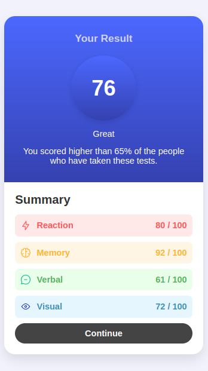
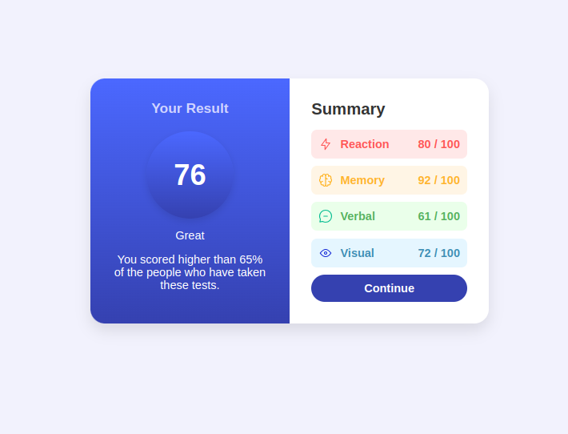

# Results Summary Component

This project is a responsive **Results Summary Component** built using **HTML** and **CSS**. It displays a test score summary, styled with a clean and modern design. The component features a results section on the left and a summary section on the right, making it easy to interpret scores.

---

## 🚀 **Features**

1. **Responsive Design**: 
   - The layout adapts for both mobile and desktop screens using media queries.
   - On smaller screens, the layout stacks vertically.
   - On larger screens, the results and summary sections display side by side.

2. **Modern UI**:
   - Clean design with a mix of gradients, shadows, and border radii.
   - Clear division between the results and summary sections.
   - Color-coded summary items for better visualization.

3. **Interactive Button**:
   - "Continue" button changes color when hovered.

4. **Custom Fonts & Icons**:
   - Utilizes **Font Awesome** icons for enhanced UI.

---

## 📂 **File Structure**
```
project-folder/
|-- index.html          # Main HTML file
|-- images/             # Folder for images
|   |-- icon-reaction.svg
|   |-- icon-memory.svg
|   |-- icon-verbal.svg
|   |-- icon-visual.svg
|-- README.md           # Documentation file
```

---

## 🎨 **Technologies Used**

- **HTML5**
- **CSS3**
- **Font Awesome** (for icons)

---

## 🖥️ **How to Use**

1. Clone the repository or download the files.
   ```bash
   git clone https://github.com/your-username/results-summary-component.git
   ```
2. Open the `index.html` file in any modern browser.

3. Ensure that the `images` folder contains all the necessary icon files:
   - `icon-reaction.svg`
   - `icon-memory.svg`
   - `icon-verbal.svg`
   - `icon-visual.svg`

---

## 📱 **Responsive Behavior**

- **Mobile View**: The results and summary sections are displayed in a vertical layout.
- **Desktop View**: The results are displayed on the left, and the summary is on the right.

---

## 🛠️ **Customization**

- **Colors**: To change the gradient or section background colors, update the respective CSS classes:
   - `.results` for the left section gradient
   - `.summary-item.reaction`, `.memory`, `.verbal`, `.visual` for summary backgrounds
- **Font**: Modify the `font-family` property in the `*` selector within the CSS.

---


## 📄 **License**
This project is open source and available under the [MIT License](LICENSE).

---

## 🧩 **Screenshots**

### **Mobile View**


### **Desktop View**


### **Desktop Active**



