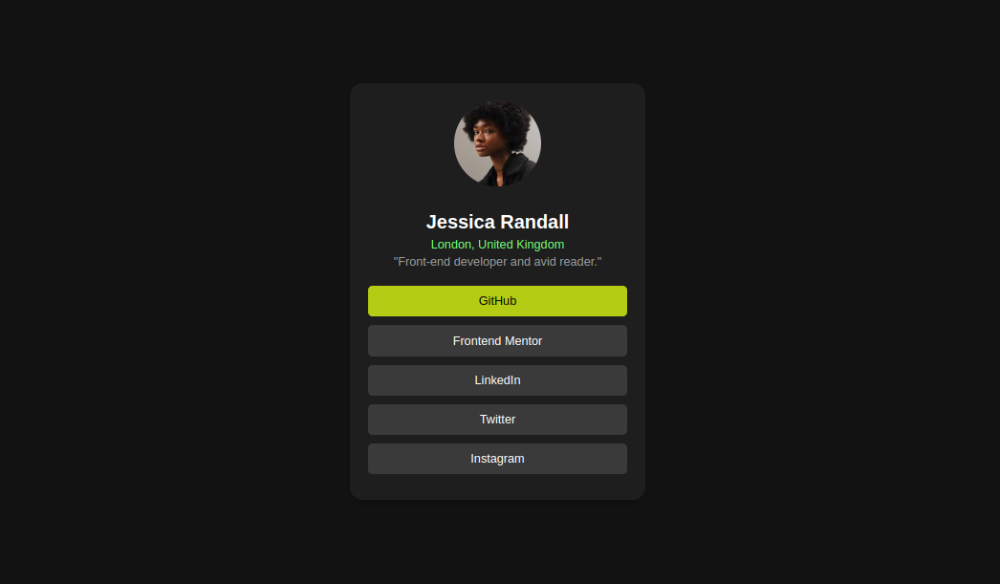

# Profile Card

This project creates a simple, responsive profile card using HTML and CSS. The card displays a user's profile picture, name, location, a short bio, and a list of buttons linking to various platforms.

---

## Features

- **Profile Picture**: A round profile image with customizable dimensions.
- **User Details**:
  - Full name
  - Location in a highlighted green color
  - Short bio with a muted text style
- **Action Buttons**: Styled buttons for GitHub, Frontend Mentor, LinkedIn, Twitter, and Instagram.
- **Responsive Design**: The card is centered and adapts to various screen sizes.

---

## Technologies Used

- **HTML5**: For structuring the content.
- **CSS3**: For styling the profile card.

---

## How to Use

1. **Clone or Download**: Copy the HTML code into your project directory.
2. **Run in Browser**:
   - Save the code in a `.html` file (e.g., `profile-card.html`).
   - Open the file in a web browser.
3. **Customizations**:
   - Replace the placeholder profile picture with an actual image URL.
   - Modify the user details (name, location, and bio) directly in the HTML file.
   - Update button labels and link them to real URLs.

---

## File Structure

- **HTML**: Defines the structure of the card.
- **CSS**: Inline styles for ease of use. You can move styles to an external stylesheet for cleaner code.

---

## Customization Guide

### Profile Image
Replace the following line in the HTML:
```html

```
Use your own image URL.

### Buttons
Change the button text and add links:
```html
<button class="github">GitHub</button>
```
Wrap buttons with `<a>` tags or include custom links for functionality.

---

## Example
- **Name**: Jessica Randall
- **Location**: London, United Kingdom
- **Bio**: "Front-end developer and avid reader."

---

## screenshot

---

## Future Enhancements
- Add hover effects with scaling animations.
- Use external fonts like Google Fonts for a modern look.
- Implement a light/dark mode toggle.

---

## License
This project is open-source and free to use for any purpose.

---

**Enjoy building your profile card!**

